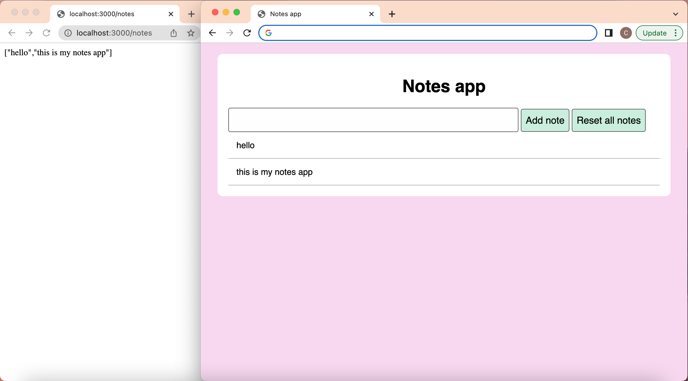

# Notes App - Javascript Web Application

## Project overview

A notes javacript web application that runs inside the user browser and communicates with backend APIs.

## Learning objectives

- Test-drive a Javascript program running in a web browser, using modern JS build tools.
- Model, View, Client (MVC) class design
- Use the DOM to manipulate the web page structure and content.
- Use `fetch` to send HTTP requests to a remote server.

## How to run

Install dependencies by running `npm install` in the top level and `/notes-app-backend` directories.

To start the `/notes-app-backend` server:

```shell
npm start
```

To view the notes webpage:

```shell
open index.html
```

### Technologies

- JavaScript
- Jest
- [`jest-fetch-mock`](https://www.npmjs.com/package/jest-fetch-mock) module
- `esbuild` build tool
- HTML
- CSS

## Notes page


